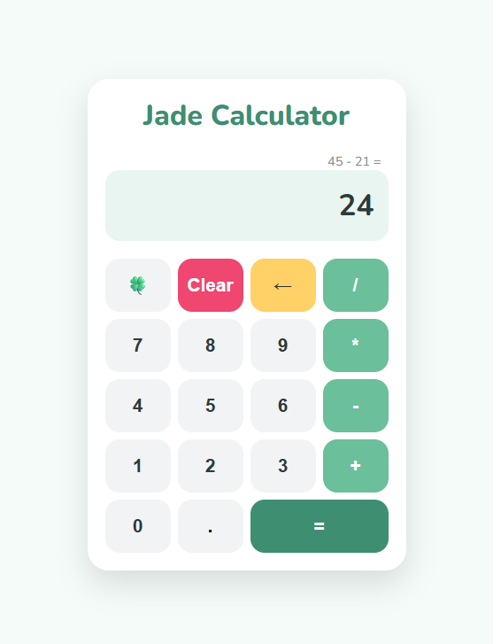
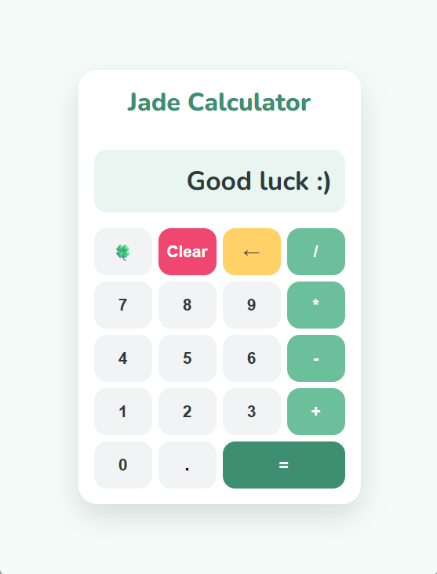

# Jade Calculator 🍀

A clean, responsive calculator built with **HTML, CSS, and JavaScript** as part of **The Odin Project Foundations** curriculum.

## Features

- Basic arithmetic operations:
  - Addition (+)
  - Subtraction (-)
  - Multiplication (\*)
  - Division (/)

- Chained calculations
- Running expression display showing the full calculation as you type
- Decimal support
- Backspace functionality
- Clear button
- Keyboard support
- Division-by-zero handling
- Dynamic display sizing to prevent overflow on long results
- Responsive design for desktop and mobile
- Custom jade-inspired UI theme
- 🍀 Lucky button with an encouraging message

## Technologies Used

- HTML5
- CSS3
- JavaScript

## Live Demo

[Live Demo](https://jadecodelab.github.io/jade-calculator/)

## Screenshots

  
  &nbsp;&nbsp;&nbsp;
  

## What I Learned

This project helped me practice:

- DOM manipulation
- Event listeners
- State management
- JavaScript functions
- CSS Grid layouts
- Responsive design
- Debugging and refactoring code

## Future Improvements

- Theme switcher
- Sound effects and animations

## Acknowledgements

Built as part of **The Odin Project Foundations** curriculum.
